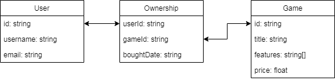

Да се направи имплементация на SQL сървър за платформата за компютърни игри Steam.
--

Да се дефинират класове за потребител, игра и съответствието между потребител и притежаваните от него игри.


Да се имплементира клас SteamServer, който съдържа колекции от горните класове(това ще представляват таблиците от нашата база данни). Да се дефинира метод `query` за изпълнение на заявка върху тези данни. Този метод като аргумент получава заявката и като резултат връща резултата от нейното изпълнение. Самите заявки да се реализират чрез ламбда изрази.

В main метода да се направи демонстрация, като:
- се инстанцира класа SteamServer
- добавят се тестови потребители, игри и собствености
- изпълнят се няколко заявкви и се изпише техния резултат

Примерни заявки в SQL-like псевдокод(тяхната логика трябва да е имплементирана на Java в ламбда изразите):
```sql
Намиране на ID-то на потребител по неговото име
SELECT id
FROM users
WHERE users.username = search_username
```

```sql
Намиране на игри, чиито заглавия съдържат даден текст
SELECT *
FROM games
WHERE games.title LIKE search_title
```

```sql
Намиране на всички игри, които съдържат търсения списък от функционалности
SELECT *
FROM games
WHERE games.features CONTAINS search_features_array
```

```sql
Намиране на всички игри, които са притежавани от потребителя със зададеното ID
SELECT *
FROM games
WHERE games.id in
  SELECT *
  FROM game_ownership
  WHERE game_ownership.userid = search_user_id
```
